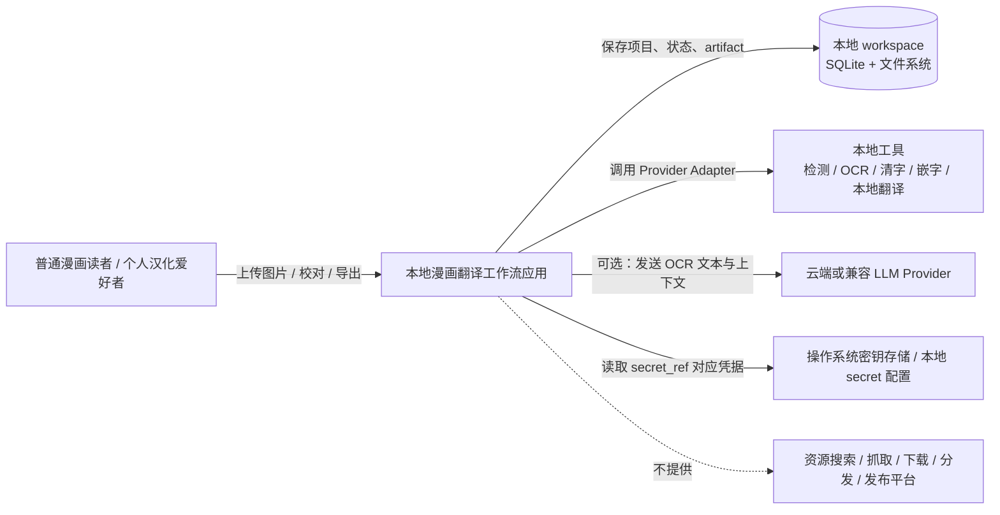
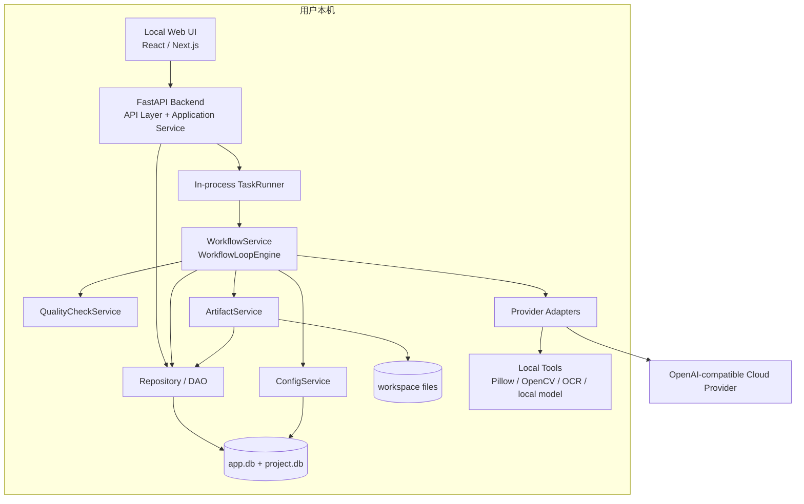
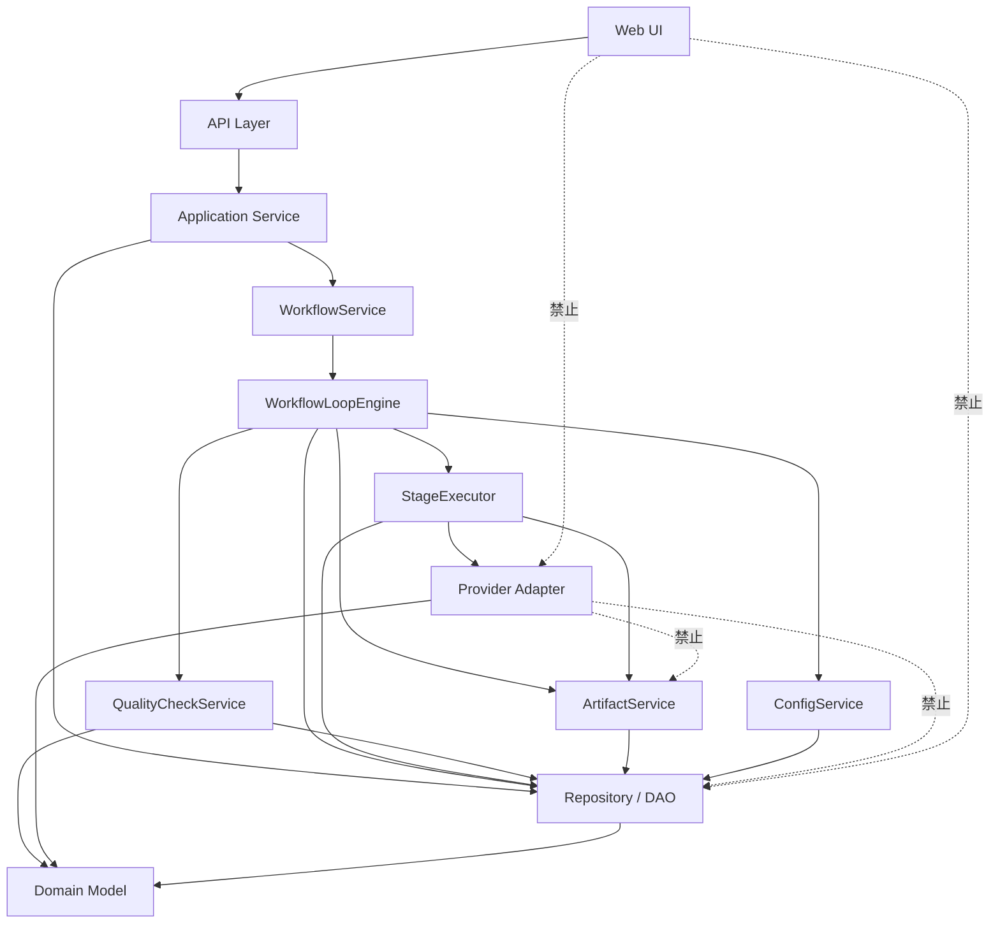
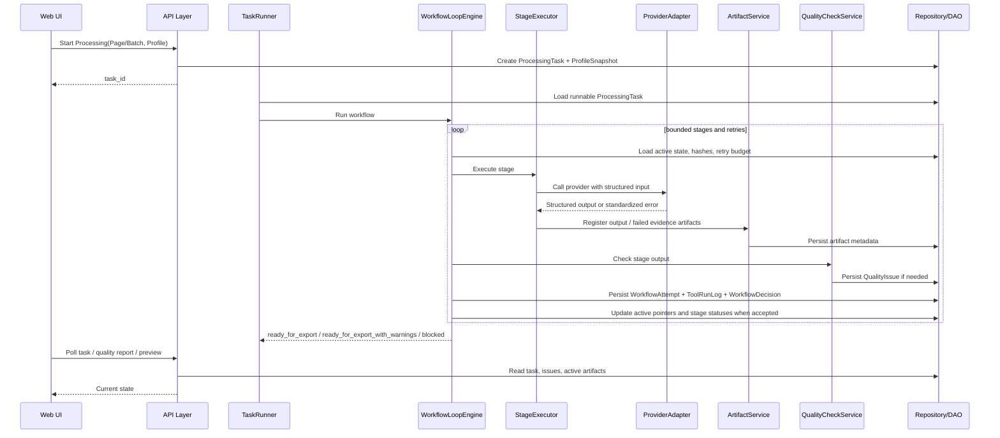
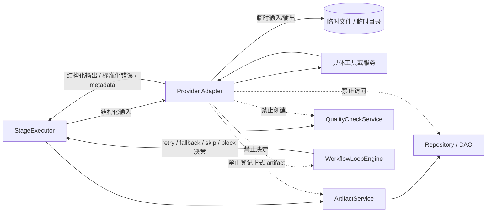
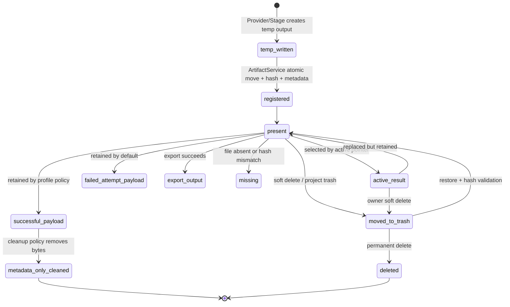

# 系统概要设计说明书 HLD v0.2

版本：v0.2
状态：Accepted Architecture Baseline / 2026-07-17 MVP 路线重排修订
适用阶段：M0 已完成 / MVP-1 单页视觉质量 / MVP-2 语义质量 / MVP-3 规模化
目标读者：项目维护者本人、AI 编码代理、后续详细设计与实现阶段
基线关系：承接 SRS v1.0，吸收 Data Model Detailed Design v0.1 的架构反馈与数据边界决策

## 0. v0.2 补强说明

本版本不改变 HLD v0.1 的核心架构方向。

v0.2 的补强目标是将 HLD 从“可进入详细设计的概要设计初稿”推进为“可作为详细设计与 MVP 实现基线的体系结构说明书”。补强范围包括：

1. 补充架构视图，用图示固定系统上下文、容器、模块依赖、Workflow Loop、Provider Adapter 和 Artifact 生命周期；
2. 增加 ADR 索引，明确哪些关键架构决策需要独立记录；
3. 增加质量属性场景，使中断恢复、Provider 拒绝、导出阻塞、artifact 丢失、API key 缺失和局部失败隔离可验证；
4. 同步数据模型详细设计 v0.1 的已定决策，避免 HLD 与数据模型在 active pointer、export gate、Provider refusal、ProcessingProfileSnapshot 等问题上漂移；
5. 增加架构验证计划，作为 MVP 垂直切片和后续实现验收的前置依据。

v0.2 仍不展开具体 DDL、API schema、Prompt 模板、Provider JSON schema、状态转移表、前端页面细节和完整测试用例。这些内容继续放入对应详细设计文档。

---

## 1. 文档目的

本文档用于定义“漫画翻译与基础嵌字自动化工作流应用”的系统概要设计。

本文档承接 SRS v1.0 需求方向，重点回答以下问题：

1. 应用采用什么形态；
2. 系统如何分层和拆分模块；
3. Project / Batch / Page / TextBlock 等核心对象如何组织；
4. 一键处理流程如何自动执行；
5. Workflow Loop、Quality Gate、状态恢复、artifact 管理如何支撑无人值守处理；
6. OCR、翻译、清字、嵌字等外部工具如何通过 Provider Adapter 接入；
7. UI 如何支持一键处理、结果预览、质量报告和局部返工；
8. 错误、NSFW、云端 Provider、API key 和本地数据如何处理。

本文档不展开以下内容：

1. 具体数据库 DDL；
2. 具体 API schema；
3. 具体 Prompt 模板；
4. OCR、清字、嵌字算法细节；
5. 详细 UI 样式；
6. 具体模型版本和第三方工具参数；
7. 完整测试用例。

这些内容将在后续详细设计阶段分别展开。

---

## 2. 设计目标与非目标

### 2.1 设计目标

当前第一个产品 MVP 目标是：

在真实 Project / Batch / Page 结构下，对一张真实漫画页面生成完整、干净、舒适、可直接阅读的中文结果。

理想路径为：

```text
创建 Project
→ 创建上传批次
→ 上传 1 页漫画图片
→ 选择 ProcessingProfile
→ 点击一键翻译
→ 系统执行检测、OCR、Page 级翻译、气泡实例关联、质量检查、清字、嵌字
→ 必要时执行一次有界局部修正或由用户修正可信 OCR/译文
→ 对支持范围生成 high-quality ready_for_export 结果
→ 用户可直接导出
```

长期目标仍是一键、低人工并接近零人工。MVP-1 允许开发期 review 和可信 OCR/译文输入用于隔离验证视觉闭环；这不是产品运行期必须逐块确认的设计。

### 2.2 最高优先级

MVP-1 最高优先级：

```text
支持范围窄、范围内质量高的单 Page 视觉闭环，
并保留最小预览、文字修正、局部返工和导出入口。
```

### 2.3 可牺牲内容

MVP-1 可以牺牲：

1. UI 美观程度；
2. 大批量整章处理体验；
3. 发布级字体匹配、艺术效果和精修细节；
4. 复杂拟声词、花体字、艺术字；
5. 高级字体与复杂排版；
6. 多人协作；
7. 云端部署；
8. 专业汉化组流程；
9. 完整漫画阅读器；
10. 高级 Provider 编排界面。

MVP-1 不可牺牲：

1. 支持范围内 TextSegment 的完整追踪；
2. 普通气泡实例拓扑；
3. 普通气泡 Cleaning eligibility 的可解释性；
4. 清字完整性与人物/线稿/边界安全；
5. BubbleInstance 级排版约束；
6. 实际 glyph 不溢出、不跨实例；
7. 自然字号、断行、留白和视觉居中；
8. excluded 区域的明确原因；
9. 资源有界和结果可复现。

### 2.4 非目标

当前 MVP 路线均不提供：

1. 漫画资源搜索；
2. 漫画资源抓取；
3. 漫画资源下载；
4. 漫画资源分发；
5. 发布平台；
6. 多人协作；
7. 商业化云端批处理；
8. 专业汉化组级别精修；
9. 对第三方 Provider 内容策略的规避能力。

### 2.5 产品里程碑与架构关系

```text
M0      Architecture Proof（历史 MVP-0，已完成）
MVP-1   高质量单页视觉闭环
MVP-2   OCR 与翻译语义质量闭环
MVP-3   规模化、性能与复杂 Workflow
```

M0 已证明 WorkflowLoopEngine、Provider Adapter、ArtifactService、Repository / UoW、QualityIssue、active pointer、recovery 和 idempotency 基础；它不代表真实 Provider、UI、正式导出或产品质量已经完成。

里程碑重排只改变产品实现顺序和质量门槛，不推翻本 HLD 的模块边界、依赖方向、状态持久化、artifact 生命周期和 export gate。

---

## 3. 应用形态与部署方式

### 3.1 MVP 应用形态

MVP 采用：

```text
CLI + 本地后端服务 + 本地 Web UI
```

具体形态：

1. CLI 用于启动本地服务和开发调试；
2. 本地 Web UI 用于主要用户操作；
3. 后端服务运行在本机；
4. OCR、清字、嵌字 worker 运行在本机；
5. SQLite 和 workspace 位于本地文件系统；
6. 翻译 Provider 支持 OpenAI-compatible API，可指向云端或本地兼容服务。

### 3.2 最终产品形态

最终目标是本地桌面应用。

桌面化阶段可将本地后端和 Web UI 包装为桌面应用，例如 Electron、Tauri 或其他桌面壳。

桌面壳只负责：

1. 启动本地服务；
2. 提供窗口；
3. 管理托盘或启动器；
4. 管理基础配置。

桌面壳不改变核心后端、worker、Provider Adapter、workspace 和数据库结构。

### 3.3 启动方式

MVP-1 开发与验证阶段允许命令行启动；最小单页产品 Gate 仍要求可操作入口。

目标产品阶段应支持双击启动器。

---

## 4. 总体架构

### 4.1 技术选型

后端：

```text
Python + FastAPI
```

前端：

```text
React + Next.js
```

任务执行：

```text
MVP 使用同进程 TaskRunner。
```

存储：

```text
SQLite + 本地文件系统 workspace
```

### 4.2 总体分层

系统分为以下层：

```text
Web UI
API Layer
Application Service
WorkflowService
WorkflowLoopEngine
QualityCheckService
TaskRunner
Provider Adapters
Repository / DAO
ArtifactService
ConfigService
Domain Model
```

### 4.3 架构原则

1. 前端不得直接访问数据库；
2. 前端不得直接调用 OCR、翻译、清字、嵌字工具；
3. FastAPI 是唯一业务后端；
4. 长任务不得直接在 API handler 中同步执行；
5. API 创建 ProcessingTask 后返回 task_id；
6. TaskRunner 后台执行任务；
7. WorkflowService 负责任务编排；
8. WorkflowLoopEngine 负责 loop 控制；
9. QualityCheckService 负责质量检查与问题归因；
10. Provider Adapter 只负责工具调用；
11. ArtifactService 统一管理文件型中间产物；
12. Repository / DAO 统一访问 SQLite。

---

## 5. 核心模块设计

### 5.1 Web UI

职责：

1. Project 列表；
2. 新建 Project；
3. 上传图片；
4. 选择 ProcessingProfile；
5. 启动一键处理；
6. 展示任务进度；
7. 展示结果预览；
8. 展示质量报告；
9. 支持人工 review；
10. 支持局部返工；
11. 支持导出。

### 5.2 API Layer

职责：

1. 提供 FastAPI 路由；
2. 处理请求参数校验；
3. 调用 Application Service；
4. 创建 ProcessingTask；
5. 查询任务状态；
6. 提供文件预览和导出接口；
7. 不直接执行 OCR、翻译、清字、嵌字长任务。

### 5.3 Application Service

职责：

1. Project 用例；
2. Batch 用例；
3. Page 用例；
4. Glossary 用例；
5. Profile 用例；
6. Export 用例；
7. 调用 WorkflowService 启动处理任务。

### 5.4 WorkflowService

职责：

1. 启动 Batch / Page 处理；
2. 管理 ProcessingTask；
3. 调用 WorkflowLoopEngine；
4. 提供暂停、取消、恢复能力；
5. 处理任务级别状态聚合；
6. 不直接实现工具调用逻辑。

### 5.5 WorkflowLoopEngine

WorkflowLoopEngine 是 WorkflowService 内部核心控制模块。

职责：

1. 按阶段推进工作流；
2. 调用对应 StageExecutor；
3. 调用 QualityCheckService；
4. 读取 ProcessingProfile；
5. 控制 retry budget；
6. 决定 continue / retry / fallback / skip / warning / block；
7. 防止无限循环；
8. 保存 WorkflowAttempt metadata；
9. 保存 WorkflowDecision；
10. 最终产出 ready_for_export、ready_for_export_with_warnings 或 blocked。

WorkflowLoopEngine 不负责：

1. 直接调用模型；
2. 直接判断翻译质量；
3. 直接保存 artifact；
4. 直接访问数据库底层；
5. 直接拼 Prompt；
6. 直接处理 UI 展示。

### 5.6 QualityCheckService

QualityCheckService 是独立质量检查模块。

按阶段拆分：

```text
ImportCheck
DetectionCheck
OCRCheck
TranslationCheck
CleaningCheck
TypesettingCheck
ExportCheck
```

职责：

1. 检查阶段输出是否可信；
2. 生成 QualityIssue；
3. 标记问题严重程度；
4. 判断问题是否 blocking；
5. 支持下游问题反向归因到上游阶段；
6. 给出 suggested_action。

QualityCheckService 不直接推进业务状态。状态推进由 WorkflowLoopEngine 和 WorkflowStateManager 完成。

### 5.7 TaskRunner

MVP 使用同进程 TaskRunner。

职责：

1. 后台执行 ProcessingTask；
2. 避免 API 请求阻塞；
3. 支持任务暂停；
4. 支持任务取消；
5. 支持重启后恢复；
6. 后续可替换为独立 worker 进程。

### 5.8 Provider Adapters

Provider Adapter 包括：

```text
DetectorProvider
OCRProvider
TranslationProvider
CleanerProvider
TypesetterProvider
```

职责：

1. 接收结构化输入；
2. 调用具体工具；
3. 返回结构化输出；
4. 标准化错误；
5. 返回 provider metadata。

Provider Adapter 不得：

1. 访问数据库；
2. 推进状态；
3. 决定重试；
4. 决定 fallback；
5. 决定跳过；
6. 注册正式 artifact；
7. 生成 QualityIssue。

### 5.9 ArtifactService

职责：

1. 生成 artifact 路径；
2. 保存文件；
3. 计算 hash；
4. 登记 artifact metadata；
5. 管理临时文件；
6. 管理失败 artifact；
7. 支持 debug artifact 持久化策略；
8. 支持 soft delete 和清理。

### 5.10 Repository / DAO

职责：

1. 封装 SQLite 访问；
2. 保存和查询 Project / Batch / Page / TextBlock；
3. 保存 OCRResult / TranslationResult；
4. 保存 Artifact；
5. 保存 ProcessingTask；
6. 保存 WorkflowAttempt；
7. 保存 WorkflowDecision；
8. 保存 QualityIssue；
9. 支持事务；
10. 支持 migration。

### 5.11 ConfigService

职责：

1. workspace 配置；
2. Provider 配置；
3. API key / base URL 配置；
4. ProcessingProfile 管理；
5. debug artifact 策略；
6. 字体路径；
7. 导出格式；
8. 默认语言配置。

---

## 6. 核心领域模型

### 6.1 领域对象总览

核心对象：

```text
Project
Batch
Page
TextBlock
ContactBubbleCluster
BubbleInstance
TextSegment
OCRResult
TranslationResult
GlossaryTerm
GlossaryVersion
ProcessingTask
ProcessingProfile
WorkflowAttempt
WorkflowDecision
QualityIssue
ProcessingArtifact
ToolRunLog
ExportRecord
```

### 6.2 Project

Project 必须存在。

即使第一阶段只处理单页，也必须在 Project 下运行。

Project 职责：

1. 隔离不同漫画项目；
2. 保存默认源语言和目标语言；
3. 关联术语表；
4. 关联 Batch；
5. 关联 project.db；
6. 关联 workspace 项目目录。

### 6.3 Batch

Batch 必须存在。

第一阶段 Batch 可以只包含 1 个 Page。

UI 上可将 Batch 弱化为：

```text
上传批次
章节
```

但系统内部必须保留 Batch 对象。

### 6.4 Page

Page 必须属于 Batch。

Page 表示一张漫画图片。

Page 关联：

1. 原图 artifact；
2. TextBlock 列表；
3. 当前 active 清字图；
4. 当前 active 嵌字图；
5. 导出结果；
6. Page 级状态；
7. Page 级 QualityIssue 聚合。

### 6.5 TextBlock

TextBlock 在检测阶段创建。

TextBlock 表示页面中的一个文本区域。

TextBlock 至少包含：

1. bbox；
2. 文本方向；
3. reading_order；
4. 检测置信度；
5. 分阶段状态；
6. active OCRResult；
7. active TranslationResult；
8. 关联清字和嵌字 artifact；
9. QualityIssue 聚合。

### 6.5.1 MVP-1 视觉对象语义

当前 `TextBlock` 数据基线继续有效，但 MVP-1 的视觉闭环不得假设 TextBlock、文字组、气泡和排版槽天然一对一。详细设计必须表达以下语义：

```text
Page
├── ContactBubbleCluster (0..N)
│   └── BubbleInstance (1..N)
│       ├── TextSegment (0..N)
│       └── LayoutSlot (0..N)
└── unsupported / regionless text
```

约束：

1. ContactBubbleCluster 是接触或串联气泡的候选簇，不是最终 Cleaning / Typesetting 边界；
2. 一个 cluster 内 BubbleInstance 数量不固定为两个；
3. 每个 BubbleInstance 拥有独立 bubble mask、文字归属、清字区域、protected boundary、typesetting region 和 validator scope；
4. 一个 BubbleInstance 可以包含多个 TextSegment / LayoutSlot；
5. LayoutSlot 不得替代 BubbleInstance；
6. 每个 eligible TextSegment 必须唯一归属一个 BubbleInstance，或以明确原因 excluded；
7. 证据不足时必须 abstain / block，不强制合并、分割或清字。

本节固定领域语义，不在 HLD 中提前固定表结构。是否新增持久化实体或以 revision/artifact metadata 表达，由 MVP-1 详细设计决定，但不得破坏现有 active pointer 与 Repository / ArtifactService 边界。

### 6.6 OCRResult

一个 TextBlock 允许多个 OCRResult。

用户修改 OCR 时，不物理覆盖旧结果，而是创建新的 OCRResult，并将其标记为 active。

### 6.7 TranslationResult

一个 TextBlock 允许多个 TranslationResult。

用户修改译文时，不物理覆盖旧结果，而是创建新的 TranslationResult，并将其标记为 active。

TranslationResult 需要记录：

1. source_text；
2. translation_text；
3. provider；
4. model_id；
5. prompt_version；
6. glossary_version；
7. input_hash；
8. config_hash；
9. quality flags；
10. 是否 user_edited；
11. 是否 active。

### 6.8 GlossaryTerm 与 GlossaryVersion

GlossaryTerm 属于 Project。

术语表不全局共享。

Glossary 需要版本。

TranslationResult 应记录生成时使用的 glossary_version。

### 6.9 ProcessingProfile

ProcessingProfile 控制一键处理行为。

内置 profile：

```text
快速
平衡
严格
```

用户可创建自定义 profile。

ProcessingProfile 控制：

1. 检查严格程度；
2. OCR retry budget；
3. Translation retry budget；
4. Translation reviewer round；
5. Shorten translation retry budget；
6. Cleaning retry budget；
7. Typesetting retry budget；
8. 是否启用 LLM reviewer；
9. 是否允许 warning 导出；
10. 是否自动导出；
11. 是否自动跳过复杂区域；
12. 是否在 blocking 错误时暂停。

### 6.10 WorkflowAttempt

WorkflowAttempt 记录每一轮 loop 尝试。

所有 attempt metadata 必须保存。

attempt payload artifact 可按策略保存。

### 6.11 WorkflowDecision

WorkflowDecision 记录 WorkflowLoopEngine 为什么做出某个决策。

decision_type 包括：

```text
continue
retry_same_stage
fallback_provider
retry_upstream_stage
skip_target
mark_warning
block
finish_ready_for_export
finish_ready_for_export_with_warnings
```

### 6.12 QualityIssue

QualityIssue 记录质量问题和问题归因。

核心字段概念：

```text
discovered_stage
root_stage
issue_type
severity
is_blocking
target_type
target_id
message
suggested_action
status
```

severity：

```text
info
warning
error
blocking
```

---

## 7. Workflow Loop 与 Quality Gate 设计

### 7.1 核心原则

系统主流程不是一次性线性流水线。

错误设计：

```text
检测 → OCR → 翻译 → 清字 → 嵌字 → 导出
```

正确设计：

```text
阶段执行
→ 质量检查
→ 自动修复 / 重试 / fallback / 跳过 / warning / block
→ 继续推进
```

### 7.2 Loop 目标

Workflow Loop 的目标：

```text
减少人工参与，使一键处理尽可能自动产出可导出结果。
```

非目标：

```text
自动保证发布级汉化质量。
```

MVP-1 只实现有界的单页局部 loop：

```text
阶段执行
→ Validator
→ 最多一次局部修正或重跑
→ 通过 / 明确 block
```

MVP-1 不要求多级 Provider fallback、长 retry budget、跨页回溯、批次调度、并发任务管理或大量 ProcessingProfile 分支。这些能力由现有架构预留，产品级实现后移到 MVP-3。

### 7.3 Loop 控制

WorkflowLoopEngine 根据以下输入做决策：

1. 当前阶段；
2. 阶段输出；
3. QualityIssue；
4. ProcessingProfile；
5. retry budget；
6. attempt history；
7. Provider 可用性；
8. artifact 状态；
9. TextBlock / Page 状态。

### 7.4 阶段级 Loop

阶段 loop 示例：

```text
Detection
→ DetectionCheck
→ retry / mark needs_manual_textblock / skip complex region

OCR
→ OCRCheck
→ retry OCR / fallback OCR / manual_source_needed

Translation
→ TranslationCheck
→ retry page / retry selected blocks / shorten translation / needs_review

Cleaning
→ CleaningCheck
→ 修正 eligibility / text mask / safe edit region / skip unsupported / block ordinary-dialogue miss

Typesetting
→ TypesettingCheck
→ BubbleInstance attribution check / shrink font / reflow / margin correction / warning / block

Export
→ ExportCheck
→ regenerate / block / export_with_warnings
```

### 7.5 Loop 预算

loop 必须有限。

预算由 ProcessingProfile 控制。

预算耗尽后：

1. 非 blocking 问题进入 ready_for_export_with_warnings；
2. blocking 问题进入 blocked；
3. 不允许无限循环。

对于 MVP-1 声明支持的普通对白或旁白框，静默缺失、跨 BubbleInstance、明显残字、结构损坏和 glyph 溢出属于 blocking；不得通过 warning export 将其自动解释为高质量单页结果。复杂拟声词、艺术字和明确不支持区域可以保留原图并记录非 blocking exclusion。

---

## 8. 主处理流程

### 8.1 一键处理入口

用户上传图片后，系统不立刻处理。

用户进入处理配置页，选择或确认 ProcessingProfile 后点击“一键翻译”。

### 8.2 主流程

```text
Create Project
→ Create Batch
→ Import Page
→ ImportCheck
→ User clicks Start Processing
→ Create ProcessingTask
→ WorkflowLoopEngine starts
→ Detect TextBlocks
→ DetectionCheck
→ OCR TextBlocks
→ OCRCheck
→ Build PageTranslationContext
→ Page-level Translation
→ TranslationCheck
→ Auto retry / selected retry / shorten if needed
→ Cleaning
→ CleaningCheck
→ Typesetting
→ TypesettingCheck
→ ExportCheck precondition
→ ready_for_export / ready_for_export_with_warnings / blocked
```

### 8.3 Page 级翻译

翻译调用粒度：

```text
Page
```

翻译存储粒度：

```text
TextBlock
```

Page 级翻译输入：

1. Page 内所有 TextBlock；
2. reading_order；
3. OCR 文本；
4. Project glossary；
5. glossary_version；
6. 当前上下文；
7. 已确认译文；
8. style goal；
9. ProcessingProfile。

LLM 返回结构化 JSON。

系统再将译文写入每个 TextBlock 的 TranslationResult。

### 8.4 单块重翻

单块重翻不能裸翻。

单块重翻应携带：

1. 整页 OCR 文本；
2. 整页已有译文；
3. Project glossary；
4. reading_order；
5. 当前目标 TextBlock ID。

模型只重写目标 TextBlock。

### 8.5 人工 review

人工 review 是后处理能力。

默认一键流程不要求用户逐块 review。

用户可在以下情况下进入 review：

1. 主动提高质量；
2. 修复 warning；
3. 处理 blocked；
4. 修改 OCR；
5. 修改译文；
6. 接受 warning；
7. 跳过 TextBlock；
8. 局部重翻；
9. 局部重嵌字。

### 8.6 MVP-1 单页视觉闭环顺序

MVP-1 的实现和验证顺序为：

```text
可信 Detection / Grouping / OCR / Translation 输入
→ provenance 完整性
→ ContactBubbleCluster / BubbleInstance
→ Cleaning eligibility
→ pixel text mask / safe edit region
→ Cleaning
→ BubbleInstance-aware typesetting region
→ Typesetting
→ actual-glyph Validator
→ 一次局部 loop
→ preview / correction / export
```

在 MVP-1 中使用人工修正或冻结 OCR/译文，只能证明“给定可信文字输入的视觉闭环”。完整自动 OCR/翻译质量由 MVP-2 验收，Batch、复杂恢复和吞吐量由 MVP-3 验收。

---

## 9. 状态机设计

### 9.1 Batch 状态

```text
created
imported
queued
processing
auto_checking
auto_retrying
paused
cancelled
reviewing
partially_failed
failed
ready_for_export
ready_for_export_with_warnings
completed
exported
blocked
```

### 9.2 Page 状态

```text
uploaded
detecting
detected
ocr_processing
ocr_done
translating
translated
translation_checking
cleaning
cleaned
typesetting
typeset_done
auto_checking
auto_retrying
reviewing
partially_failed
ready_for_export
ready_for_export_with_warnings
completed_with_warnings
failed
skipped
exported
blocked
```

### 9.3 TextBlock 分阶段状态

TextBlock 不采用单一 status，而采用分阶段状态：

```text
detection_status
ocr_status
translation_status
translation_check_status
cleaning_status
typesetting_status
review_status
```

阶段状态：

```text
pending
running
done
failed
skipped
needs_review
stale
locked
```

### 9.4 paused 与 cancelled

paused：

```text
用户手动暂停或系统可恢复暂停。
任务可继续。
已完成结果保留。
```

cancelled：

```text
用户主动取消。
任务不自动继续。
已完成结果、artifact、日志和状态保留。
如需继续，应创建新 ProcessingTask 或手动选择从当前结果重新开始。
```

### 9.5 skipped 规则

TextBlock skipped 不等于 failed。

Page 存在 skipped block 时：

1. 可以进入 ready_for_export_with_warnings；
2. 不应进入纯 ready_for_export；
3. 质量报告必须显示 skipped block。

### 9.6 stale 规则

用户修改 OCR 后：

```text
当前 TextBlock:
translation_status = stale
translation_check_status = stale
typesetting_status = stale
review_status = needs_review

Page:
translation_context_stale = true
needs_review = true
```

用户修改译文后：

```text
当前 TextBlock:
typesetting_status = stale
review_status = needs_review

Page:
has_stale_blocks = true
needs_review = true
```

用户修改 TextBlock 区域后：

```text
cleaning_status = stale
typesetting_status = stale
```

### 9.7 重启恢复

应用重启后，Workflow 根据以下信息恢复：

1. ProcessingTask；
2. TextBlock 分阶段状态；
3. WorkflowAttempt；
4. WorkflowDecision；
5. Artifact；
6. QualityIssue；
7. active result 指针。

恢复不能只看 Page status。

### 9.8 避免重复调用

避免重复调用 OCR / LLM 依赖：

```text
input_hash
config_hash
provider
model_id
prompt_version
glossary_version
artifact_hash
active result status
```

Provider Adapter 不负责缓存判断。

WorkflowService / WorkflowLoopEngine 负责决策是否执行。

Repository 和 ArtifactService 负责查询可复用结果。

---

## 10. 存储与 Artifact 设计

### 10.1 数据库结构

系统采用：

```text
app.db + project.db
```

app.db 保存全局数据。

project.db 保存单 Project 内数据。

### 10.2 app.db 职责

```text
projects
global_settings
provider_configs
processing_profiles
recent_projects
workspace_config
schema_migrations
```

### 10.3 project.db 职责

```text
batches
pages
text_blocks
ocr_results
translation_results
glossary_terms
glossary_versions
processing_tasks
workflow_attempts
workflow_decisions
quality_issues
processing_artifacts
tool_run_logs
exports
schema_migrations
```

### 10.4 Workspace

workspace 由用户第一次启动时选择。

若用户未选择，系统提供默认路径，例如：

```text
~/MangaTranslator/workspace
```

目录结构：

```text
workspace/
  app.db
  config/
    providers.local.json
    profiles.local.json
  projects/
    {project_id}/
      project.db
      originals/
      pages/
        page_0001/
          detection/
          crops/
          ocr/
          translation/
          masks/
          cleaned/
          typeset/
          export/
          quality/
          attempts/
          logs/
      exports/
      trash/
```

### 10.5 图片与大文件

图片和大文件不进入 SQLite。

SQLite 只保存：

1. file_path；
2. file_hash；
3. artifact_type；
4. project_id；
5. batch_id；
6. page_id；
7. text_block_id；
8. source_step；
9. tool_run_id；
10. created_at。

### 10.6 Artifact 保存策略

必存 artifact：

1. original image；
2. active cleaned image；
3. active typeset image；
4. export image / zip；
5. mask；
6. quality report；
7. failed attempt artifact。

可选持久保存：

1. crop image；
2. raw OCR output；
3. raw LLM request；
4. raw LLM response；
5. detection visualization；
6. successful attempt payload；
7. debug log bundle。

临时 artifact：

1. 可重建 crop；
2. 临时 preview；
3. 成功 attempt 的大型 payload。

### 10.7 WorkflowAttempt 保存策略

所有 WorkflowAttempt metadata 必须保存。

attempt payload artifact 策略：

1. 失败 attempt 默认保存；
2. 成功 attempt 默认不持久保存 raw payload；
3. debug 模式全部保存；
4. 严格模式可保存更多 payload。

### 10.8 删除策略

删除 Project 采用 soft delete / 回收站机制。

永久删除需要二次确认。

---

## 11. Provider Adapter 设计

### 11.1 Provider 类型

系统定义以下 Provider 接口：

```text
DetectorProvider
OCRProvider
TranslationProvider
CleanerProvider
TypesetterProvider
```

### 11.2 DetectorProvider

职责：

```text
输入 Page 原图；
输出 TextBlock 候选区域、bbox、方向、置信度、reading_order 候选。
```

Detector 不负责 OCR 文本识别。

### 11.3 OCRProvider

职责：

```text
输入 TextBlock crop 或 bbox；
输出 OCR 文本、置信度、方向信息、原始输出 metadata。
```

OCRProvider 不创建 TextBlock。

### 11.4 TranslationProvider

MVP 只实现 OpenAI-compatible Provider。

接口保持抽象，避免 OpenAI-compatible 请求格式污染 Workflow 层。

职责：

```text
输入 PageTranslationContext；
输出 PageTranslationOutput。
```

### 11.5 CleanerProvider

允许多个实现：

1. simple white fill；
2. OpenCV inpaint；
3. LaMa；
4. 后续其他 inpainting 工具。

MVP-1 可以先实现简单方案，但接口必须允许替换。

### 11.6 TypesetterProvider

MVP-1 阶段自研实现，使用 Pillow / PIL。

职责：

1. 中文文本绘制；
2. 自动换行；
3. 字号自适应；
4. 溢出检测；
5. 最小字号限制；
6. 结果图生成。

虽然 MVP 只有一个实现，但仍通过 TypesetterProvider 接口接入。

### 11.7 Provider 错误类型

标准错误类型：

```text
provider_unavailable
provider_timeout
provider_refusal
invalid_input
invalid_output
model_error
dependency_missing
file_io_error
unsupported_content
unknown_error
```

Provider Adapter 识别错误。

WorkflowLoopEngine 决策如何处理错误。

### 11.8 Provider 文件边界

Provider Adapter 不负责正式 artifact 生命周期。

允许：

```text
Provider 使用临时文件。
```

禁止：

```text
Provider 自己决定 artifact 路径；
Provider 自己写入 workspace 正式目录；
Provider 自己登记数据库；
Provider 自己决定文件清理策略。
```

正式 artifact 由 ArtifactService 管理。

---

## 12. UI 与交互概要设计

### 12.1 首页

首页展示：

1. 最近 Project；
2. 新建 Project；
3. 打开 Project；
4. 设置入口。

### 12.2 创建 Project

必填：

1. Project 名称；
2. 源语言；
3. 目标语言；
4. 默认 ProcessingProfile。

可选：

1. 自定义 Project 存储位置；
2. 初始术语表导入。

workspace 默认继承全局设置。

### 12.3 上传与处理配置

上传图片后进入处理配置页。

处理配置页允许：

1. 查看待处理页面；
2. 选择 ProcessingProfile；
3. 展开高级设置；
4. 启动一键翻译。

### 12.4 一键处理前配置

默认使用上次配置。

用户可展开修改：

1. 处理模式；
2. 检查严格度；
3. retry budget；
4. 是否启用 LLM reviewer；
5. 是否允许 warning 导出；
6. 是否自动导出；
7. debug artifact 策略。

### 12.5 处理过程 UI

默认显示：

1. 当前阶段；
2. 当前页；
3. 总体进度；
4. warning 数量；
5. error 数量；
6. 是否可导出。

可展开查看：

1. 实时日志；
2. Page 状态；
3. TextBlock 状态；
4. QualityIssue；
5. WorkflowAttempt；
6. Provider 调用记录。

non-blocking warning 不打断处理。

blocking 错误按 ProcessingProfile 处理。

### 12.6 处理完成页

显示：

1. 结果预览；
2. 导出按钮；
3. 质量报告摘要；
4. warning / error 列表；
5. 进入人工 review 入口；
6. 重新处理入口。

### 12.7 质量报告

质量报告按 Page / TextBlock 分组展示。

支持在图片上叠加 issue 标记。

issue 显示：

1. 问题类型；
2. 严重程度；
3. 发现阶段；
4. 疑似根因阶段；
5. 建议动作；
6. 是否阻塞导出。

### 12.8 人工 Review 页面

P0 能力：

1. 原图 / 结果图切换或对照；
2. TextBlock 框叠加；
3. 查看 OCR；
4. 查看译文；
5. 修改 OCR；
6. 修改译文；
7. 重新翻译当前 TextBlock；
8. 重新嵌字当前 TextBlock；
9. 跳过 TextBlock；
10. 接受 warning。

P1 能力：

1. 重新清字当前 TextBlock；
2. 手动调整 TextBlock 框；
3. 手动调整字体大小；
4. 手动换行；
5. 手动选择清字方式；
6. 查看完整 WorkflowAttempt。

### 12.9 高级设置页

MVP 高级设置包括：

1. Provider / API key；
2. OpenAI-compatible base URL；
3. 默认模型；
4. workspace；
5. ProcessingProfile；
6. debug artifact 保存策略；
7. 字体路径；
8. 导出格式。

---

## 13. 错误处理、合规与边界

### 13.1 错误分类

系统使用统一 ErrorCode / IssueType。

覆盖：

1. import；
2. detection；
3. OCR；
4. translation；
5. cleaning；
6. typesetting；
7. export；
8. filesystem；
9. database；
10. provider；
11. config；
12. workflow。

### 13.2 用户错误与内部错误分离

用户界面显示：

1. 可理解错误原因；
2. 影响范围；
3. 建议动作。

内部日志保存：

1. stack trace；
2. provider response metadata；
3. tool run 信息；
4. attempt 信息；
5. config hash；
6. input hash。

API key 不得进入日志。

### 13.3 API key 错误

API key 缺失或无效时：

1. 相关 Provider 标记 unavailable；
2. 若无 fallback，则依赖该 Provider 的阶段 blocked；
3. UI 提示配置 API key 或切换 Provider。

不是整个系统因缺少云端 API key 而不可用。

### 13.4 Provider 拒绝

云端 LLM Provider 拒绝处理内容时：

1. Provider Adapter 返回 provider_refusal；
2. WorkflowLoopEngine 根据 ProcessingProfile 决定 fallback、warning、skip 或 blocked；
3. 不将 provider_refusal 当作普通崩溃处理。

### 13.5 NSFW 边界

系统允许用户处理本地持有内容。

系统不承诺第三方 API 一定处理 NSFW 或敏感内容。

系统不主动绕过第三方 API 内容策略。

用户可自行配置本地或云端 OpenAI-compatible Provider。

系统不提供规避第三方策略的 Prompt、对抗逻辑或绕过机制。

### 13.6 资源边界

系统不提供：

1. 漫画资源搜索；
2. 漫画资源抓取；
3. 漫画资源下载；
4. 漫画资源分发；
5. 发布平台。

### 13.7 原图安全

原图永不覆盖。

所有清字、嵌字和导出结果都作为新 artifact 保存。

### 13.8 导出前检查

导出前必须检查 unresolved blocking issue。

存在 unresolved blocking issue 时，禁止正常导出。

warning 是否允许导出由 ProcessingProfile 决定。

高级操作可允许强制导出当前可生成结果，但必须标记为 forced_export / incomplete_export，并显示 blocking issue 摘要。

### 13.9 本地数据与云端 Provider

本地 Project 数据默认不上传。

只有用户启用云端 Provider 时，相关 OCR 文本、术语表和上下文才会发送给第三方服务。

系统必须提示用户该事实。

### 13.10 Debug Artifact 提示

debug artifact 可能包含：

1. 原图；
2. OCR 文本；
3. 译文；
4. LLM request；
5. LLM response；
6. 错误上下文。

系统需要在开启 debug 持久保存时提示用户。

---

## 14. 分阶段 MVP 技术路线

### 14.1 后端

```text
Python
FastAPI
SQLite
Alembic
Pydantic
```

### 14.2 前端

```text
React
Next.js
```

### 14.3 图像处理

```text
Pillow / PIL
OpenCV
```

### 14.4 OCR 与检测

DetectorProvider 与 OCRProvider 保持抽象。

MVP 可先接入开源检测/OCR 工具。

### 14.5 翻译

MVP 实现：

```text
OpenAI-compatible TranslationProvider
```

### 14.6 清字

MVP-1 先验证：

1. simple fill；
2. OpenCV inpaint；
3. 可靠 pixel text mask、safe edit region、BubbleInstance 归属与结构保护。

具体修复算法可以替换，但不得绕过 CleanerProvider、ArtifactService、QualityCheckService 和 WorkflowLoopEngine 的职责边界。

### 14.7 嵌字

MVP-1 自研最小 TypesetterProvider 能力，并先在 Spike/Harness 中冻结输入输出合同。

能力：

1. 中文字体绘制；
2. 自动换行；
3. 字号自适应；
4. 溢出检测；
5. 最小字号限制；
6. 横排中文嵌字。

额外硬约束：Renderer 与 Validator 必须使用同一 BubbleInstance region 和实际 glyph mask；ContactBubbleCluster 外轮廓、宽松 bbox 或 Cleaning mask 不得冒充最终 typesetting region。

### 14.8 里程碑技术重点

| 里程碑 | 技术重点 | 明确后移 |
| --- | --- | --- |
| M0（已完成） | FakeProvider、状态、artifact、recovery/idempotency、export readiness | 真实质量、UI、正式导出 |
| MVP-1 | 单页视觉对象、Cleaning、Typesetting、actual-glyph Validator、简单局部 loop、最小单页入口 | OCR/翻译自动准确率、Batch 性能、复杂 recovery |
| MVP-2 | OCR/reading order、Page/multi-page Translation、术语/口吻、semantic reviewer、stale propagation | 高吞吐 Batch 产品体验 |
| MVP-3 | Batch、模型复用、缓存、并发、资源预算、复杂 Workflow、正式 Web/ZIP/桌面化准备 | 专业汉化与资源分发 |

---

## 15. 分阶段 MVP 验收标准

### 15.1 M0 Architecture Proof

历史 `MVP-0 FakeProvider Backend` 已关闭。它只证明架构机制，不代表产品 MVP。

### 15.2 MVP-1 高质量单页视觉闭环

1. 固定真实页面在可信 OCR/译文输入下生成完整中文结果；
2. 支持范围内 TextSegment 不静默丢失；
3. ContactBubbleCluster 可分解为任意数量 BubbleInstance；
4. 每个 eligible TextSegment 唯一归属并恰好渲染一次；
5. Cleaning eligibility 的排除原因、规则和特征可追踪；
6. 普通气泡不会被大量保守误排除；
7. 清字无明显可读残字，不损坏人物、线稿和气泡边界；
8. Renderer 与 Validator 使用同一 BubbleInstance mask 和实际 glyph；
9. 不溢出、不跨实例，字号、断行、留白和视觉中心人工可接受；
10. unresolved 普通对白缺失产生 blocking QualityIssue；
11. 最多一次局部自动修正或重跑，之后明确通过或 block；
12. 存在最小单页预览、OCR/译文修正、局部返工和图片导出入口；
13. 原图不覆盖，输出和 provenance 可复现；
14. 无 OOM、无界内存增长、无限循环或单页无法结束。

### 15.3 MVP-2 OCR 与翻译质量

1. 固定连续多页样本关键文字无静默漏识；
2. OCR、reading order、Page / multi-page context 达到冻结门槛；
3. 译文语义、术语、称谓、代词和口吻一致；
4. OCR/翻译不确定性可见；
5. 修改 OCR/译文后，下游正确 stale 并局部重跑；
6. 翻译质量问题不会被视觉结果掩盖。

### 15.4 MVP-3 规模化与复杂 Workflow

1. 一章固定样本可稳定处理；
2. Batch、暂停、取消、恢复、失败隔离可验证；
3. retry/fallback/refusal/QualityIssue/export gate 可解释；
4. 模型复用、缓存、并发和资源预算有界；
5. ZIP、manifest、进度、配置、备份和日志满足个人产品使用；
6. 正式本地 Web 闭环完成。

---

## 16. 当前详细设计与实现顺序

HLD 的架构基线已被 M0 验证。后续不再按“先 API/UI/Batch，最后质量收敛”的顺序推进，而按产品里程碑逐步补足详细设计。

### 16.1 已完成或已形成基线的详细设计

| 设计项 | 当前状态 | 说明 |
| --- | --- | --- |
| 数据模型详细设计 | 已形成 v0.1 基线 | 已明确 `app.db + project.db`、active pointer、artifact metadata、WorkflowAttempt、WorkflowDecision、QualityIssue、ToolRunLog、ExportRecord 等核心数据边界。 |
| Workflow State / Workflow Loop 详细设计 | 已形成 v0.1 基线 | 已明确状态词汇、阶段转移、决策矩阵、retry budget、恢复规则和 stale 传播。 |
| Execution Contract 详细设计 | 已形成 v0.1 基线 | 已明确 Provider Adapter、ArtifactService、QualityCheckService、StageExecutor、FakeProvider 的 MVP-0 最小契约。 |
| Persistence Readiness 详细设计 | 已形成 v0.1 基线 | 已明确 Repository / DAO、Unit of Work、migration、acceptance transaction、recovery 和 idempotency 实现边界。 |
| M0 FakeProvider Architecture Proof | 已完成并关闭 | 历史 Slice 01–07 已证明后端机制；停在 `ready_for_export`，不代表真实产品闭环。 |
| 真实工具 Spike | 已形成阶段性证据 | Detection/OCR、Translation、Cleaning、Text-first association、Typesetting 已暴露真实能力边界，需以最新报告为准。 |

### 16.2 后续设计与验证任务

| 优先级 | 详细设计项 | 输出文档建议 | 主要内容 |
| --- | --- | --- | --- |
| MVP1-1 | 视觉对象与 provenance 合同 | `docs/design/` 或 bounded spike | ContactBubbleCluster、N BubbleInstance、TextSegment/LayoutSlot、eligible/excluded/rendered 对账。 |
| MVP1-2 | Cleaning eligibility 与 mask 合同 | bounded spike / Cleaning 设计 | 普通气泡假阴性诊断、pixel mask、safe edit region、protected boundary。 |
| MVP1-3 | Typesetting 与 Validator 合同 | bounded spike / Typesetting 设计 | BubbleInstance region、actual glyph、占用率、留白、视觉中心、一次局部 loop。 |
| MVP1-4 | 最小单页 API/UI/Export | `docs/design/api/`、`docs/design/ui/`、`docs/design/export/` | 只实现单页上传、预览、文字修正、局部返工、单图导出，不扩 Batch。 |
| MVP2 | OCR/Translation 质量设计 | 后续设计目录 | OCR reviewer、multi-page context、术语/口吻、不确定性和 stale propagation。 |
| MVP3 | Batch/Recovery/Performance/Product | 后续设计目录 | 复杂 Workflow、资源预算、ZIP、正式 Web、配置、备份与桌面化。 |

### 16.3 不应塞回 HLD 的内容

以下内容不进入 HLD 正文，只在详细设计或实现文档中展开：

1. SQLite DDL、SQLAlchemy model、Alembic migration；
2. FastAPI 具体 route schema；
3. Provider 具体 JSON schema；
4. TranslationProvider Prompt 模板；
5. Pillow 排版算法细节；
6. OCR / 清字工具参数；
7. 完整测试用例；
8. 前端组件树和样式规范。

---

## 17. 当前设计结论摘要

本系统的核心不是线性工具链，而是一个本地运行的、可恢复的、以 Workflow Loop 驱动的漫画翻译自动化工作流。

核心架构判断：

```text
本地 Web UI + FastAPI 后端 + 同进程 TaskRunner
+ SQLite / filesystem
+ WorkflowLoopEngine
+ QualityCheckService
+ Provider Adapter
+ ArtifactService
```

核心产品判断：

```text
长期一键处理默认低人工并接近零人工。
开发期人工 review 用于验证，不默认成为运行期必经流程。
MVP-1 可用可信文字输入隔离验证视觉质量。
复杂且明确不支持区域的 warning 不默认阻塞。
支持范围内普通对白的缺失、残字、结构损坏、跨实例和溢出必须阻塞高质量单页验收。
blocking 必须阻塞正常导出。
翻译使用 Page 级上下文调用。
结果按 TextBlock 存储。
所有关键中间结果可追踪、可恢复、可局部返工。
```

---

## 18. 架构视图

本节用于补足 HLD v0.1 中图示不足的问题。以下图示是架构级视图，不替代后续详细设计中的接口 schema、数据库 DDL、状态转移表和 UI 原型。

### 18.1 系统上下文图



架构含义：

1. 系统默认在用户本机运行；
2. Project 数据、原图、artifact 和 workflow 状态默认保存到本地 workspace；
3. 云端 LLM Provider 是可配置外部依赖，不是系统必需边界；
4. 应用不提供漫画资源搜索、抓取、下载、分发和发布能力；
5. 本地工具和云端 Provider 都必须通过 Provider Adapter 接入。

### 18.2 容器 / 部署图



部署约束：

1. Web UI 不直接访问数据库和文件系统正式 artifact；
2. API handler 不同步执行长任务；
3. TaskRunner 与 FastAPI 同进程是 MVP 选择，后续可替换为独立 worker；
4. Provider Adapter 不访问 Repository，不登记正式 artifact，不决定 retry/fallback/skip/block；
5. ArtifactService 是正式 workspace 文件生命周期唯一入口。

### 18.3 模块依赖图



依赖规则：

1. UI 只通过 API 进入系统；
2. Application Service 编排业务用例，不实现 Provider 调用细节；
3. WorkflowLoopEngine 负责决策，不直接实现 OCR、翻译、清字、嵌字算法；
4. QualityCheckService 负责发现和分类质量问题，不推进状态；
5. Repository / DAO 封装 SQLite，Provider Adapter 不越过此边界；
6. ArtifactService 封装正式 artifact 生命周期，Provider Adapter 只能使用临时文件。

### 18.4 Workflow Loop 时序图



关键约束：

1. 每一轮 stage attempt 都必须有限；
2. 外部 Provider 调用前先持久化 attempt/task 起始状态；
3. Provider 返回后，通过 ArtifactService 登记文件，再由 WorkflowLoopEngine 和 QualityCheckService 更新决策与状态；
4. active pointer、QualityIssue、WorkflowDecision 和 stage status 应在同一事务边界内保持一致；
5. crash recovery 不能只依赖 Page.status。

### 18.5 Provider Adapter 调用边界图



Provider Adapter 只做“调用适配”，不做“业务裁决”。这条边界是避免工具耦合、测试困难和恢复状态不可解释的关键架构约束。

### 18.6 Artifact 生命周期图



Artifact 规则：

1. 原图不可覆盖；
2. 图片和大 payload 不进入 SQLite；
3. SQLite 只保存 artifact metadata、hash、路径、scope、retention、storage_state；
4. active original、active cleaned、active typeset、active mask、export output、失败证据 artifact 不得被普通 cleanup 删除；
5. 文件缺失不是删除记录，应记录为 `missing` 并进入修复或降级路径。

---

## 19. 关键架构决策与 ADR 索引

HLD 正文保留架构结论，ADR 记录“为什么这样选、拒绝什么、后果是什么”。跨详细设计域的架构 ADR 放入 `docs/adr/architecture/`；只影响单一设计域的 ADR 放在 `docs/design/<area>/adr/`：

```text
docs/adr/architecture/
```

### 19.1 架构 ADR 清单

| ADR | 决策 | 状态 | 主要后果 |
| --- | --- | --- | --- |
| `0001-local-web-fastapi.md` | MVP 采用本地 Web UI + FastAPI 后端 | Accepted | 保留桌面化可能，降低前期桌面壳复杂度。 |
| `0002-inprocess-taskrunner.md` | MVP 使用同进程 TaskRunner | Accepted for MVP | 快速实现中断恢复和任务状态；后续可替换独立 worker。 |
| `0003-app-db-project-db-split.md` | 使用 `app.db + project.db` | Accepted | 强化 Project 隔离、备份、恢复和删除边界。 |
| `0004-provider-adapter-boundary.md` | OCR/检测/翻译/清字/嵌字全部经 Provider Adapter | Accepted | 工具可替换；Provider 不接触数据库和正式 artifact。 |
| `0005-artifactservice-owns-files.md` | ArtifactService 统一正式 artifact 生命周期 | Accepted | 避免路径、hash、retention、trash 策略分散。 |
| `0006-workflow-loop-quality-gate.md` | 主流程采用 Workflow Loop + Quality Gate | Accepted | 一键处理可自动重试、fallback、warning、block。 |
| `0007-qualityissue-export-gate.md` | 正常导出阻塞 open blocking QualityIssue | Accepted | 导出安全可数据化复现。 |
| `0008-processing-profile-snapshot.md` | 执行时保存 immutable ProcessingProfileSnapshot | Accepted | 历史 retry、warning export、retention 决策可解释。 |
| `0009-active-result-pointers.md` | active pointer 是 P0 当前结果唯一来源 | Accepted | 避免 result 表 active flag 冲突。 |
| `0010-provider-refusal-first-class.md` | Provider refusal 是一等 workflow 路径 | Accepted | 拒绝不当作普通崩溃，可 fallback / manual / block。 |
| `0011-original-image-safety.md` | 原图永不覆盖 | Accepted | 所有清字、嵌字、导出都生成新 artifact。 |
| `0012-nsfw-and-provider-policy.md` | 不绕过第三方 Provider 内容策略 | Accepted | 可本地处理合法自用内容，但不提供规避策略。 |

### 19.2 ADR 与详细设计的关系

ADR 不替代详细设计。ADR 只固定高层决策，详细设计继续负责：

1. DDL / ORM / migration；
2. API route / DTO；
3. Provider input/output schema；
4. Workflow 状态转移表；
5. retry budget 算法；
6. Artifact 目录布局与原子写入；
7. QualityIssue taxonomy；
8. UI 交互细节。

---

## 20. 质量属性场景

本节将 HLD 中已有的可靠性、可恢复性、可维护性、安全边界和成本控制要求转化为可验证场景。

### 20.1 场景总表

| 场景 ID | 质量属性 | 触发条件 | 期望响应 | 架构机制 | 验证方式 |
| --- | --- | --- | --- | --- | --- |
| QA-REC-001 | 中断恢复 | 处理过程中应用进程退出 | 重启后识别 interrupted/running task，恢复到可继续状态，已完成 OCR/翻译不重复调用 | ProcessingTask heartbeat、WorkflowAttempt、active pointer、artifact hash、stage status | Crash recovery test |
| QA-REC-002 | 单块失败隔离 | 某 TextBlock OCR 或翻译失败 | 失败块记录 QualityIssue，其他块继续处理，Page 可进入 warning 或 blocked | TextBlock 分阶段状态、QualityIssue scope、WorkflowDecision | FakeProvider partial failure test |
| QA-REL-001 | 原图安全 | 清字、嵌字或导出执行 | 原始上传图片不被覆盖，所有输出为新 artifact | Page.original_artifact_id、ArtifactService、workspace 目录策略 | Artifact lifecycle test |
| QA-REL-002 | Provider 拒绝 | 云端翻译 Provider 返回 policy refusal | 记录 refusal，不崩溃；按 profile fallback、manual、warning 或 block | Provider Adapter 标准错误、ToolRunLog、WorkflowAttempt、QualityIssue、WorkflowDecision | Provider refusal test |
| QA-REL-003 | Artifact 丢失 | active cleaned/typeset 文件被手动删除 | 标记 artifact missing，不盲目导出；可重建则重建，不可重建则产生 blocking issue | ProcessingArtifact.storage_state、hash validation、ExportCheck | Missing artifact test |
| QA-SEC-001 | API key 缺失 | 用户启动云端翻译但未配置 API key | 翻译 Provider unavailable；相关阶段 blocked 或 fallback；不影响本地 Project 浏览 | ConfigService、ProviderConfig secret_ref、Provider availability check | Config failure test |
| QA-SEC-002 | 敏感 debug payload | 用户开启 debug artifact 持久化 | UI 提示可能包含原图、OCR、译文和 Provider 响应；日志不得包含 secret | Artifact safety flags、redaction、ConfigService warning | Debug artifact inspection |
| QA-MNT-001 | Provider 替换 | 从云端翻译切换到本地 OpenAI-compatible Provider | Workflow 层不改动，仅替换 provider config 和 adapter 配置 | Provider Adapter、ProviderConfig、ProcessingProfileSnapshot | Adapter contract test |
| QA-MNT-002 | 详细设计演进 | 后续加入 LaMa 或竖排排版 | 不影响 API、Workflow 和 Result 版本模型主干 | CleanerProvider/TypesetterProvider 抽象、artifact metadata | Extension spike |
| QA-COST-001 | 避免重复调用 | 用户重新处理未变化 TextBlock | 命中缓存或复用 result，记录 reused_cached，不重复 OCR/LLM | input_hash、config_hash、provider/model、glossary/context hash、WorkflowDecision | Idempotency test |
| QA-EXP-001 | 导出阻塞 | 导出范围内存在 open blocking QualityIssue | ExportRecord blocked，不生成正常 output artifact | ExportCheck、QualityIssue query、ExportRecord | Export gate test |
| QA-EXP-002 | warning 导出 | 仅存在 warning issue | 按 ProcessingProfileSnapshot.allow_warning_export 决定导出或阻塞 | Profile snapshot、QualityIssue severity、ExportRecord warning snapshot | Warning export test |
| QA-VIS-001 | 支持对象完整性 | 普通对白已 detected/translated，但未进入 Cleaning/Typesetting | 生成 blocking issue，报告各阶段数量和 exclusion reason，不得静默导出高质量结果 | provenance ledger、QualityCheckService、ExportCheck | Stage accounting test |
| QA-VIS-002 | 接触气泡拓扑 | 多个独立气泡像素相邻或接触 | 输出一个 cluster 下 N 个 BubbleInstance，每个 segment 唯一归属实例 | BubbleInstance contract、association artifact | Contact cluster harness |
| QA-VIS-003 | Renderer/Validator 同源 | Renderer 生成实际 glyph | Validator 使用完全相同的 BubbleInstance region ID/hash 与 glyph mask；宽松 parent region 不得通过 | Artifact hash、TypesettingCheck | Deliberate overflow/wrong-instance test |
| QA-VIS-004 | Cleaning eligibility | 普通白色气泡被风险分类排除 | 保存原因、规则和特征；无法解释时标记潜在假阴性并 block 单页高质量验收 | CleaningCheck、QualityIssue | Eligibility review harness |

### 20.2 中断恢复场景

目标：验证系统不依赖单一 Page.status 恢复。

触发：

```text
处理到 OCR 完成、Translation 尚未开始时，进程异常退出。
```

期望：

1. 重启时发现 `ProcessingTask.status = running` 且 heartbeat stale；
2. 将任务标记为 `interrupted`，再进入 `recovering`；
3. 检查 active OCR pointer、OCRResult、artifact、WorkflowAttempt 和 ToolRunLog；
4. 若 OCR 结果完整，修复状态并从 translation 继续；
5. 不重新调用 OCR Provider。

### 20.3 Provider 拒绝场景

目标：验证 Provider refusal 是 workflow path，而不是系统异常。

触发：

```text
TranslationProvider 返回 provider_refusal / policy refusal。
```

期望：

1. Provider Adapter 返回标准化错误；
2. ToolRunLog 记录 `is_provider_refusal = true`；
3. WorkflowAttempt 记录 refused；
4. QualityIssue 记录 root_stage = provider_policy；
5. WorkflowDecision 根据 ProcessingProfileSnapshot 决定 fallback_provider、pause_for_user、mark_warning、skip_target 或 block；
6. UI 给出可理解提示，不暴露敏感 provider payload。

### 20.4 Export Gate 场景

目标：验证导出是数据驱动的 gate，而不是 UI 状态判断。

触发：

```text
用户尝试导出 Page 或 Batch。
```

期望：

1. ExportCheck 查询目标范围内 `is_blocking = true and status = open` 的 QualityIssue；
2. 存在 blocker 时，创建或更新 ExportRecord 为 blocked；
3. 不生成正常 output artifact；
4. 仅有 warning 时，读取执行时 ProcessingProfileSnapshot 决定是否允许 warning export；
5. 成功导出时记录 output artifact、manifest artifact 和 issue snapshot。

### 20.5 Artifact 丢失场景

目标：验证文件系统漂移不会造成静默错误。

触发：

```text
用户手动删除 active typeset artifact 文件后点击预览或导出。
```

期望：

1. ArtifactService 检查路径和 hash；
2. 文件不存在或 hash 不一致时，将 artifact 标记为 `missing`；
3. 如果可由 active cleaned artifact + active translation 重建，则触发重建；
4. 如果不可重建，则 QualityCheckService 产生 blocking issue；
5. ExportCheck 阻止正常导出。

### 20.6 MVP-1 单页视觉场景

目标：验证自动指标与真实单页视觉结果一致。

触发：

```text
固定真实页包含普通独立气泡、接触气泡和明确不支持文字。
```

期望：

1. detected / translated / eligible / excluded / rendered 数量可对账；
2. 接触簇中的 BubbleInstance 数量和 segment 归属正确；
3. 普通气泡不被无解释地排除；
4. 清字无明显残字且不破坏边界/人物；
5. 每个实际 glyph 只位于对应 BubbleInstance mask；
6. Validator 能拒绝 deliberate overflow、wrong instance、segment missing 和 duplicate rendering；
7. 一次局部 loop 后结果通过人工 `ACCEPTABLE`，否则进入 blocked；
8. 复杂拟声词等 unsupported 区域可保留原图并继续其他区域。

---

## 21. 与数据模型详细设计 v0.1 的同步边界

数据模型详细设计 v0.1 已经对若干 HLD 概要决策进行了收敛。本节将这些结果回填到 HLD，避免后续详细设计之间发生概念漂移。

### 21.1 已同步的核心决策

| 决策项 | HLD v0.2 固定口径 | 影响范围 |
| --- | --- | --- |
| `app.db + project.db` | app.db 保存全局注册、全局设置、ProviderConfig、ProcessingProfile；project.db 保存 Project 内容、workflow、quality、artifact、export。 | 存储、Repository、migration、backup/restore。 |
| active pointer | `TextBlock.active_ocr_result_id`、`TextBlock.active_translation_result_id`、`Page.original_artifact_id`、`Page.active_cleaned_artifact_id`、`Page.active_typeset_artifact_id` 是 P0 当前结果来源。 | UI、Workflow、Export、Recovery。 |
| 不使用 result active flag | OCRResult / TranslationResult 不维护独立 active flag。 | ORM、Repository、并发更新。 |
| ProjectConfig 映射 | SRS 中的 ProjectConfig 不作为独立 P0 表；映射到 Project defaults、ProviderConfig references、ProcessingProfile templates 和 ProcessingProfileSnapshot。 | 数据模型、配置 UI、任务执行。 |
| ProcessingProfileSnapshot | 每次任务/export 使用 immutable snapshot，不能只引用当前 mutable profile。 | retry、warning export、retention、历史解释。 |
| Provider refusal | 作为 ToolRunLog + WorkflowAttempt + QualityIssue + WorkflowDecision 持久化。 | 错误处理、合规边界、恢复、UI 提示。 |
| Export gate | 正常导出阻塞 open blocking QualityIssue；warning export 由 ProcessingProfileSnapshot 决定。 | ExportService、QualityCheckService、UI 导出按钮。 |
| Artifact storage state | 使用 `present`、`metadata_only_cleaned`、`moved_to_trash`、`missing`、`deleted`。 | ArtifactService、cleanup、trash、restore。 |
| Page-level translation partial output | Page 级翻译 attempt 可产生部分 TranslationResult，同时为缺失/无效 block 创建 QualityIssue。 | TranslationProvider、QualityCheck、Review UI。 |
| Crash recovery vocabulary | 使用 `interrupted`、`recovering`、`abandoned_after_crash` 处理 stale running task/attempt。 | TaskRunner、Workflow recovery、UI 状态。 |
| TranslationResult source link | TranslationResult 必须记录 `source_ocr_result_id` 和 `source_text_hash`。 | stale 判断、审计、缓存。 |
| TextBlock geometry | P0 geometry 字段直接放 TextBlock；GeometryRevision 延后到 P1。 | 数据模型、检测、review、清字、嵌字。 |

### 21.2 HLD 与详细设计分工

HLD 固定：

1. 系统边界；
2. 容器与模块划分；
3. 依赖方向；
4. 关键架构机制；
5. 决策来源与 ADR；
6. 质量属性场景；
7. 架构验证计划。

详细设计固定：

1. 表结构、字段类型、索引、约束；
2. API route 和 DTO；
3. Provider schema；
4. 状态转移表；
5. retry budget arithmetic；
6. artifact 目录与清理细节；
7. QualityIssue taxonomy；
8. 用户提示文案；
9. 测试用例。

### 21.3 架构不变量

以下不变量在详细设计和实现中不得被局部便利破坏：

1. Provider Adapter 不访问数据库；
2. Provider Adapter 不登记正式 artifact；
3. Provider Adapter 不创建 QualityIssue；
4. WorkflowLoopEngine 决定 retry/fallback/skip/warning/block；
5. QualityCheckService 负责质量检查和 issue 分类；
6. ArtifactService 是正式 artifact 生命周期唯一入口；
7. Repository / DAO 是 SQLite 访问唯一入口；
8. 原图永不覆盖；
9. 导出必须经过 ExportCheck；
10. recovery 不能只依赖 Page.status；
11. active pointer 是当前结果 source of truth；
12. debug artifact 和 logs 不得包含 raw secret。

---

## 22. 架构验证计划

本节定义 HLD 级架构验证，不替代后续完整测试用例。验证目标是尽早证明架构机制可行，避免先堆 UI 或 Provider 集成后才发现 workflow、artifact、recovery 或 export gate 不成立。

### 22.1 验证顺序

```text
M0 AV-001..AV-006 架构机制验证（已完成）
→ MVP-1 单页视觉对象 / Cleaning / Typesetting / Validator
→ MVP-1 最小单页产品入口
→ MVP-2 OCR / Translation 语义质量
→ MVP-3 Batch / Recovery / Performance / Product
```

### 22.2 验证用例清单

| ID | 验证项 | 前置条件 | 操作 | 通过标准 |
| --- | --- | --- | --- | --- |
| AV-001 | 单 Page 垂直切片 | Fake Detector/OCR/Translator/Cleaner/Typesetter 可用 | 创建 Project、上传 1 页、启动一键处理 | 生成 TextBlock、OCRResult、TranslationResult、cleaned/typeset artifact、QualityReport、ready_for_export。 |
| AV-002 | Artifact lifecycle | 使用 FakeProvider 生成文件 artifact | 删除/替换/清理 artifact | active artifact 不被 cleanup 删除；缺失文件被标记 missing；原图不被覆盖。 |
| AV-003 | Workflow decision | FakeProvider 配置不同错误输出 | 触发 retry、fallback、skip、warning、block | 每次决策有 WorkflowAttempt、QualityIssue、WorkflowDecision 记录。 |
| AV-004 | Crash recovery | 任务执行中可强制 kill 进程 | 在 OCR 后、Translation 前 kill；重启 | 已完成 OCR 不重复调用；任务进入 recovering 后继续 translation。 |
| AV-005 | Provider refusal | Fake TranslationProvider 返回 provider_refusal | 启动翻译阶段 | refusal 被记录为 ToolRunLog + WorkflowAttempt + QualityIssue + WorkflowDecision；UI 提示 fallback/manual/block。 |
| AV-006 | Export gate | 手工插入 open blocking QualityIssue | 执行 Page export | ExportRecord blocked；不生成正常 export artifact。 |
| AV-007 | Warning export | 仅存在 warning issue | 使用 allow_warning_export true/false 的两个 profile | true 时 succeeded_with_warnings；false 时 blocked 或 rejected。 |
| AV-008 | Idempotency | 已存在同 hash OCR/translation 结果 | 重跑同一 Page | 记录 reused_cached，不重复调用对应 Provider。 |
| AV-009 | OCR edit stale propagation | 已有 active OCR/translation/typeset | 修改 OCR | 新 OCRResult active；translation/check/typesetting stale；Page context stale。 |
| AV-010 | Translation edit stale propagation | 已有 active translation/typeset | 修改译文 | 新 TranslationResult active；typesetting stale；旧译文保留。 |
| AV-011 | API key missing | 未配置云端 Provider secret | 启动需要云端翻译的 profile | Provider unavailable；系统不崩溃；Project 浏览和本地功能可用。 |
| AV-012 | Local provider replacement | 配置本地 OpenAI-compatible endpoint | 切换 TranslationProvider | Workflow 和 API 不改动，仅 ProviderConfig/Profile 改动。 |

### 22.3 FakeProvider 策略

FakeProvider 跑通 workflow 的工作已在 M0 完成。后续继续将 FakeProvider 用作架构回归，不再把它当作产品质量证据，也不再阻塞 MVP-1 真实单页视觉验证。

FakeProvider 应支持：

1. 固定成功输出；
2. 空输出；
3. invalid JSON；
4. provider_timeout；
5. provider_refusal；
6. partial translation output；
7. typeset_overflow；
8. cleaning_complex_background；
9. 可配置调用计数，用于验证 idempotency。

### 22.4 真实工具 Spike 验证边界

真实工具 Spike 已从“工具能否运行”进入“支持范围内能否形成高质量视觉闭环”的阶段。MVP-1 的 bounded spike 必须回答：

1. provenance 是否覆盖所有 detected text；
2. 接触气泡能否表达为 cluster 下任意数量 BubbleInstance；
3. 普通气泡 Cleaning eligibility 假阴性能否定位并纠正；
4. pixel text mask 和 safe edit region 是否完整且不损坏结构；
5. Typesetter 是否使用 BubbleInstance region；
6. Validator 是否检查实际 glyph、实例归属、丢失/重复、占用率、留白和视觉中心；
7. 一次局部 loop 后能否产出人工可接受的完整单页图。

### 22.5 架构验证退出标准

M0 架构退出标准已完成。进入 MVP-2 前，MVP-1 至少满足：

1. 固定真实单页视觉 Gate 通过；
2. 支持范围内没有静默漏失、残字、结构损坏、跨实例或溢出；
3. excluded 对象和原因可追踪；
4. actual-glyph Validator 与人工观察一致；
5. 最小单页预览、文字修正、局部返工和导出可操作；
6. 资源有界、输出可复现；
7. 未将复杂 SFX、专业精修或 Batch 性能扩入 MVP-1。

---

## 23. HLD 到详细设计的追踪矩阵

| HLD 主题 | 对应详细设计 | 最小输出 |
| --- | --- | --- |
| 应用形态与部署 | `docs/design/runtime/` | 启动流程、端口策略、workspace 初始化、桌面化边界。 |
| 分层与模块 | `docs/design/backend-architecture/` | 包结构、依赖规则、service/repository/provider interface。 |
| Workflow Loop | `docs/design/workflow-state/` | 状态转移表、attempt/decision 语义、retry budget、recovery algorithm。 |
| Quality Gate | `docs/design/execution-contract/` | MVP-0 IssueType taxonomy、severity/blocking matrix、message/action keys；完整 UI 文案后置。 |
| Provider Adapter | `docs/design/execution-contract/` | 五类 Provider interface、DTO、capability metadata、错误/refusal 映射。 |
| ArtifactService | `docs/design/execution-contract/` | MVP-0 official artifact lifecycle、storage_state、temp promotion、missing 检测；完整 cleanup scheduler 后置。 |
| Storage | `docs/design/data-model/` + `docs/design/persistence/` | Data model、schema outline、Repository/UoW、migration readiness。 |
| API Layer | `docs/design/api/` | route、request/response DTO、error response、stream/polling 策略。 |
| UI | `docs/design/ui-flow/` | Project、Upload、Processing、Review、QualityReport、Export 页面流。 |
| Security / Config | `docs/design/config-security/` | secret_ref、API key 保存、日志脱敏、debug artifact 提示。 |
| Export | `docs/design/export/` | 后续实际 ExportRecord、manifest schema、warning export、blocked export 行为；MVP-0 FakeProvider 当前只做到 `ready_for_export`。 |
| Testing | `docs/implementation/mvp0-fakeprovider-slice/` | FakeProvider、crash recovery、export readiness gate、artifact lifecycle 的切片级验证命令。 |

---

## 24. HLD v0.2 当前结论

HLD v0.2 的结论是：

```text
当前体系结构可以作为 MVP 详细设计与实现基线。
产品里程碑顺序更新为：先单页视觉质量，再 OCR/翻译语义质量，最后规模化与复杂 Workflow。
```

该结论成立的原因：

1. 应用形态、部署边界和技术栈已经明确；
2. 系统分层、核心模块职责和依赖规则已经明确；
3. Workflow Loop + Quality Gate + Artifact Traceability + Restart Recovery 是主架构机制；
4. Provider Adapter、ArtifactService、Repository / DAO、QualityCheckService、WorkflowLoopEngine 的职责边界已经足够清晰；
5. 数据模型详细设计 v0.1 已经反向验证并细化了 HLD 中的核心状态、artifact、workflow、quality 和 export 机制；
6. HLD v0.2 已补充架构视图、ADR 索引、质量属性场景和架构验证计划。

后续不应推翻已验证架构，也不应继续扩大 HLD 正文规模。新的工作应优先进入 MVP-1 的 bounded 详细设计、真实单页验证和最小产品入口；达到单页视觉 Gate 后立即转向 MVP-2，而不是无限延长局部算法研究。
